**Day 1 - Topic**

Method - often called function or procedures

Fields - known as variables

Variables - holds the state of the program

Can you tell if the code will compile or run, even if the code is not standard?

**Classes vs. Files**
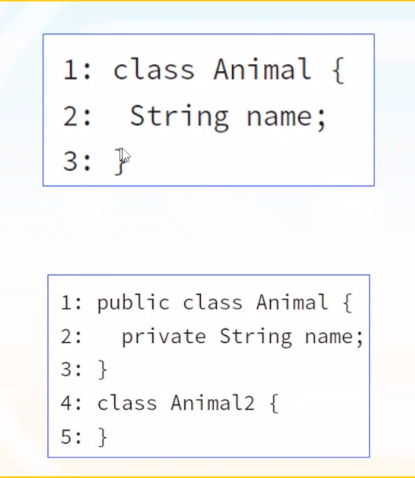

**Writing a main() Method**
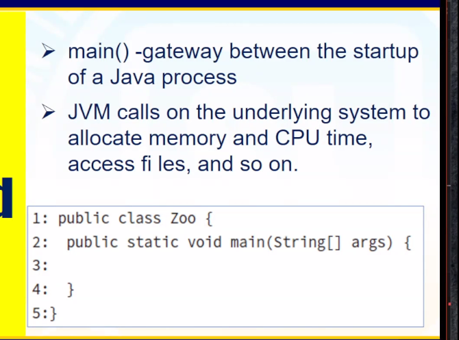

**Compiling Java**
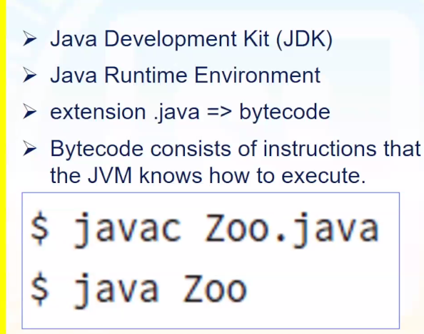

**Package Declarations and Imports**
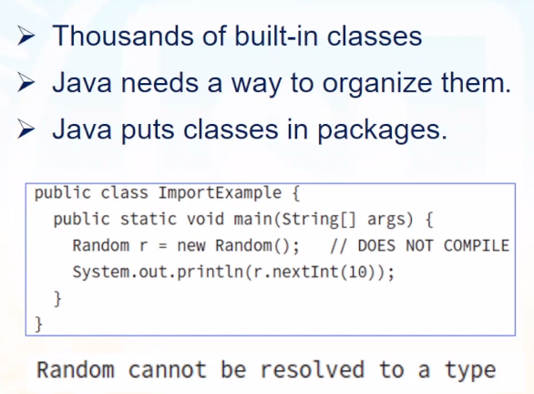

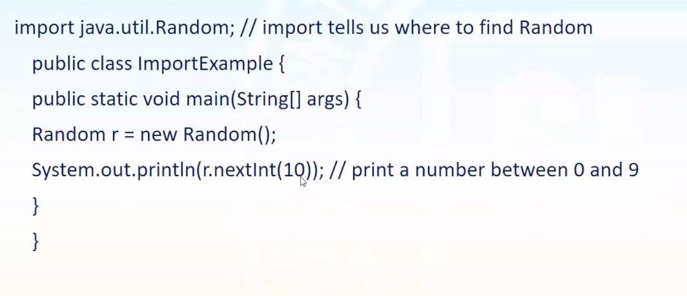

**Package Declarations and Imports Wildcards**
use import java.util.* for universal imports
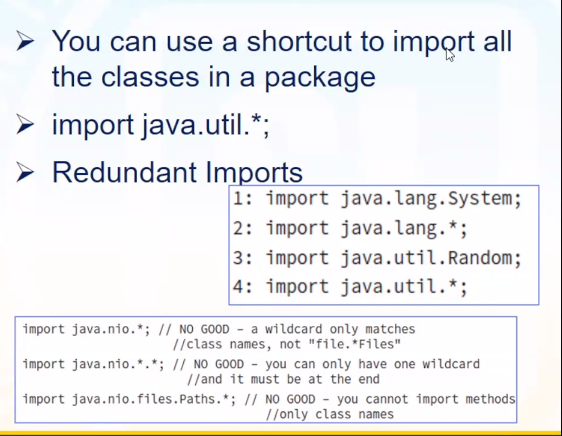

**Naming Conflicts**
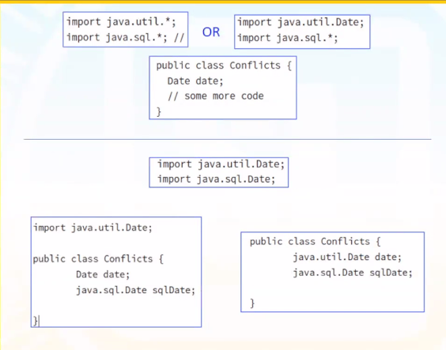

**Creating a New Package**
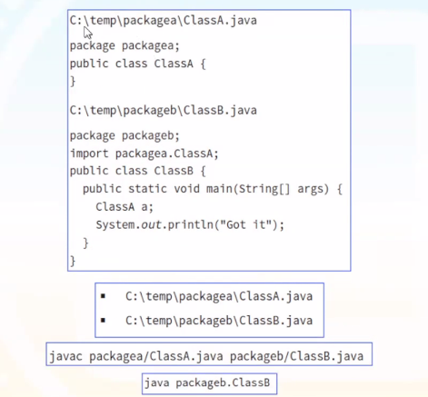

**Jar File**
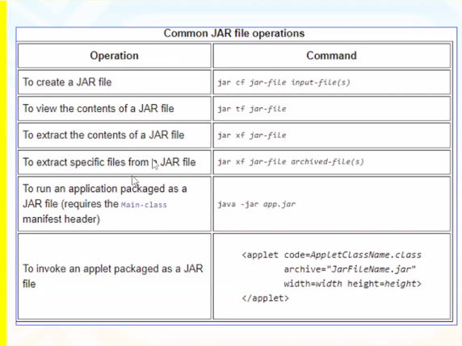

**Code Formatting on the Exam**
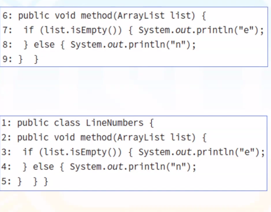

**Creating Ojects Constructors**
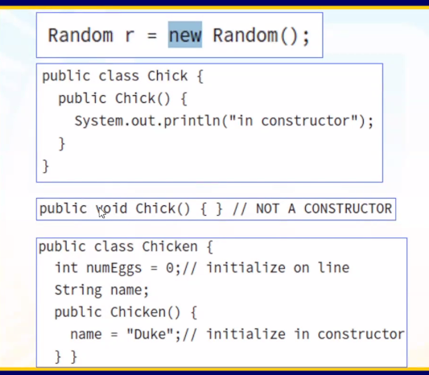

Chapter 2
**Understanding Java Operators**
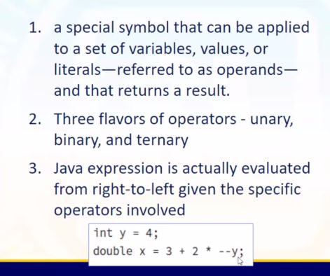

**Order of Operator Precedence**
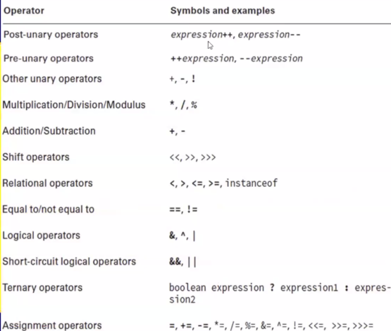
